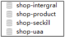
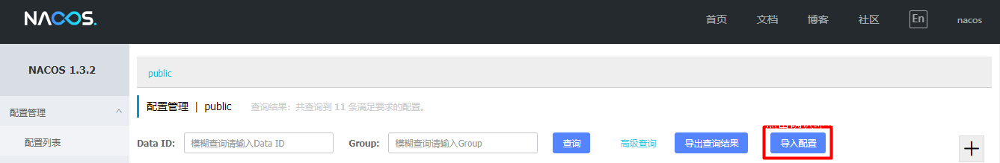
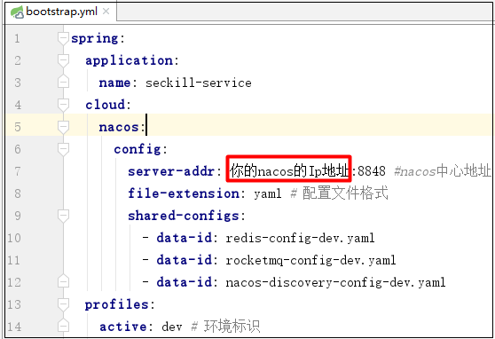

# 限时抢购项目导入文档(2020.12更新)

1.使用git clone将项目导入到你的本地目录中

2.通过idea工具将`frontend-server`项目和`shop-parent`导入

3.在flash_sale/shop-parent/配置文件/SQL脚本下的文件导入到数据库中.

```sql
-shop-intergral.sql
-shop-product.sql
-shop-seckill.sql
-shop-uaa.sql
```

导入后的结果如下:

****

4.本项目需要依赖RocketMQ,Redis,Nacos,Zookeeper,在项目运行之前确保这几个软件在你的电脑/虚拟机/远程服务器中已经安装好.比如在服务器上已经安装好之后，使用命令`jps`可以看到这几个进程:

****

5.在`flash_sale/shop-parent/配置文件/nacos配置`中找到项目的配置文件压缩包`nacos_config.zip`，访问nacos管控台,导入配置信息.



6.修改配置信息

- `rocketmq-config-dev.yaml`:修改成你的RocketMQ的地址
- `redis-config-dev.yaml`:修改成你的Redis的地址
- `job-service-dev.yaml`:修改成你的Zookeeper的地址
- `nacos-discovery-config-dev.yaml`:修改成你的Nacos的地址

项目中的`bootstrap.yml`的地址都需要修改

****